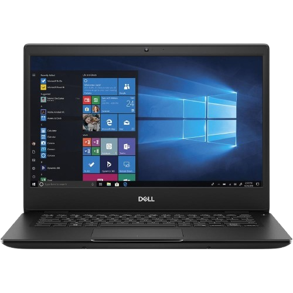

# Projeto-Cadernos-Escola-juan-alves
# Modernização Tecnológica da Escola Estadual de Tecnologia e Inovação

### 1. resumo executivo
Escola Estadual de Tecnologia e Inovação enfrenta limitações significativas devido ao uso de computadores antigos, com hardware defasado e pouca mobilidade. Este projeto propõe a aquisição de 30 notebooks modernos, permitindo maior flexibilidade, dinamismo e atualização tecnológica nas atividades pedagógicas. Espera-se aumento da eficiência operacional, redução de custos com energia e manutenção, e melhor aproveitamento dos espaços físicos da instituição, consolidando seu posicionamento como referência em educação tecnológica.

---

### 2. Introdução e Justificativa

O parque tecnológico atualmente disponível na escola é composto, em sua maioria, por desktops com mais de oito anos de utilização. Esse fator compromete significativamente o desempenho das máquinas, que, em muitos casos, não conseguem executar softwares educacionais contemporâneos, especialmente aqueles que exigem maior capacidade de processamento ou atualização constante. Tal limitação restringe o acesso dos alunos a recursos pedagógicos atualizados e reduz a eficiência das atividades em sala de aula.
Outro ponto crítico refere-se à rigidez estrutural dos laboratórios de informática, cuja configuração fixa dificulta a adoção de metodologias ativas de ensino, como aprendizagem baseada em projetos (ABP), ensino híbrido ou atividades que demandam maior interação entre grupos de estudantes e integração entre diferentes disciplinas. Em consequência, os alunos acabam limitados a um modelo tradicional, pouco dinâmico e, muitas vezes, distante das necessidades formativas da educação contemporânea.
A substituição gradativa dos desktops por notebooks surge, portanto, como uma solução estratégica e sustentável. Notebooks oferecem mobilidade, permitindo que qualquer espaço da escola – salas de aula, biblioteca, áreas externas ou até mesmo espaços comunitários – possa ser convertido em ambiente de aprendizagem. Essa flexibilidade viabiliza projetos interdisciplinares, pesquisas de campo, oficinas colaborativas e experiências práticas que ampliam o engajamento dos estudantes.
Além disso, os notebooks apresentam vantagens econômicas e ambientais relevantes: consumo de energia até 60% menor em comparação a desktops convencionais, maior vida útil devido à menor exigência de refrigeração, e manutenção simplificada, o que reduz custos operacionais. Essas características contribuem para a sustentabilidade institucional e para um aproveitamento mais eficiente dos recursos financeiros da escola.
Por fim, a modernização do parque tecnológico alinha-se às diretrizes de inovação educacional, promovendo um ambiente de ensino mais inclusivo, dinâmico e conectado às demandas do século XXI, em que a tecnologia é um eixo central para o desenvolvimento de competências digitais e para a formação integral dos estudantes.

---

### 3. Objetivos
- Atualização Integral da Infraestrutura de TI da Escola
O projeto tem como finalidade modernizar a infraestrutura tecnológica da instituição de ensino por meio da substituição de 30 computadores de mesa (desktops) por notebooks de última geração. Essa atualização busca não apenas garantir maior eficiência operacional, mas também alinhar os recursos de tecnologia da informação às necessidades atuais do processo educacional.
- Flexibilidade e mobilidade
A adoção de notebooks permitirá que os equipamentos sejam utilizados em diferentes ambientes escolres, como salas de aula, biblioteca, laboratório de ciências ou até em atividades externas.
Essa mobilidade favorece metodologias ativas de ensino, como aprendizagem baseada em projetos (ABP) e ensino híbrido.
-Maximização do uso dos equipamentos
A adoção de notebooks permitirá que os equipamentos sejam utilizados em diferentes ambientes escolares, como salas de aula, biblioteca, laboratório de ciências ou até em atividades externas.
- Eficiência energética
Estima-se uaproximadamente 30% no consumo de energia elétrica, considerando que notebooks demandam menos recursos energéticos do que desktopsma redução de .
- Segurança da informação e dos equipamentos
Serão implementados sistemas de monitoramento, rastreamento e proteção contra acessos não autorizados, assegurando a integridade dos dados e dos dispositivos.
- Capacitação da equipe escolar
Professores e profissionais de TI receberão treinamentos direcionados para o uso pedagógico e administrativo dos novos notebooks.

---

### 4. Especificações Técnicas

| Componente       | Mínimo                     | Recomendado               |
|-----------------|-----------------------------|---------------------------|
| Processador      | Intel Core i5-1135G7        | Intel Core i7-1165G7      |
| Memória RAM      | 8 GB DDR4                   | 16 GB DDR4                |
| Armazenamento    | SSD 256 GB                  | SSD 512 GB NVMe           |
| Sistema          | Windows 11 Pro              | Windows 11 Pro            |
| Tela             | 14" Full HD                 | 14" Full HD IPS           |
| Bateria          | 5h                          | 8h                        |
| Peso             | Até 2,0 kg                  | Até 1,5 kg                |
| Conectividade    | Wi-Fi 6, Bluetooth 5.0      | Wi-Fi 6E, Bluetooth 5.2   |
| Portas           | 2x USB-A, 1x USB-C, HDMI    | 2x Thunderbolt 4, HDMI, USB-A |
| Garantia         | 12 meses                    | 24 meses                  

 
Figura: Exemplos de notebooks adequados ao ambiente educacional

---

### 5. Orçamento Estimado

| Item                          | Valor Unitário (R$) | Quantidade | Total (R$) |
|--------------------------------|--------------------|------------|------------|
| Notebook                       | 5.500,00           | 30         | 165.000,00 |
| Seguro anual                   | 200,00             | 30         | 6.000,00   |
| Sistema de rastreamento        | 150,00             | 30         | 4.500,00   |
| Licenças educacionais          | 300,00             | 30         | 9.000,00   |
| Cases de proteção              | 100,00             | 30         | 3.000,00   |
| Roteadores Wi-Fi 6             | 800,00             | 2          | 1.600,00   |
| Instalação e configuração      | 1.500,00           | 1          | 1.500,00   |
| Capacitação de professores     | 2.000,00           | 1          | 2.000,00   |
| *TOTAL*                      |                    |            | *192.600,00* |

---

### 6. Benefícios Esperados
Alunos: terão acesso a tecnologias atualizadas, capazes de potencializar o aprendizado, estimulando maior engajamento e promovendo experiências colaborativas em ambientes presenciais, híbridos e remotos. Por exemplo, atividades em grupos poderão ser realizadas simultaneamente em sala de aula e em plataformas digitais, favorecendo o desenvolvimento de competências como autonomia e trabalho em equipe.

Professores: contarão com maior liberdade metodológica, podendo utilizar recursos multimídia e ferramentas interativas para ministrar aulas em diferentes espaços, como laboratórios, bibliotecas ou áreas abertas. Essa flexibilidade permitirá a aplicação de metodologias inovadoras, como aprendizagem baseada em projetos (PBL) e ensino híbrido.

Instituição: obterá ganhos em eficiência operacional, por meio da economia de energia e do uso inteligente dos espaços físicos, além de fortalecer sua imagem perante a comunidade acadêmica e o mercado educacional. A modernização da infraestrutura tecnológica também representa um diferencial competitivo, atraindo novos alunos e consolidando a reputação da instituição como referência em inovação.

### 7. Cronograma Resumido

| Fase          | Duração   | Período                | Responsáveis |
|---------------|-----------|-----------------------|-------------|
| Planejamento  | 2 semanas | 01/06/2025 - 15/06/2025 | Equipe de TI |
| Licitação     | 3 semanas | 16/06/2025 - 07/07/2025 | Administração |
| Aquisição     | 4 semanas | 08/07/2025 - 04/08/2025 | Compras |
| Instalação    | 2 semanas | 05/08/2025 - 18/08/2025 | TI e Fornecedor |
| Capacitação   | 1 semana  | 19/08/2025 - 25/08/2025 | Pedagogia e TI |
| Implantação   | 1 semana  | 26/08/2025 - 01/09/2025 | Todos |

---

### 8. Considerações Finais
A proposta de aquisição de notebooks modernos constitui um investimento estratégico para a modernização da Escola Estadual de Tecnologia e Inovação. Mais do que uma simples atualização do parque tecnológico, a iniciativa tem como finalidade ampliar a mobilidade acadêmica, otimizar o uso dos recursos institucionais e potencializar o processo de ensino-aprendizagem.
A incorporação desses equipamentos permitirá que os alunos tenham acesso a ferramentas digitais de última geração, fundamentais para o desenvolvimento de competências ligadas à inovação, ao pensamento crítico e à resolução de problemas complexos. Do ponto de vista dos professores, os notebooks oferecem maior flexibilidade para a elaboração e aplicação de metodologias ativas, como aprendizagem baseada em projetos (PBL) e ensino híbrido, que já demonstraram aumentar o engajamento e o desempenho estudantil. Além disso, estudos recentes em instituições que adotaram projetos semelhantes indicam ganhos expressivos: aumento de até 25% no rendimento em disciplinas de exatas e redução de aproximadamente 15% no índice de evasão escolar. Esses números evidenciam que a integração tecnológica não é apenas um diferencial, mas uma necessidade para alinhar a escola às demandas contemporâneas do mercado de trabalho e da sociedade digital.
Cabe destacar também o impacto positivo em termos de inclusão social. O acesso a notebooks possibilitará que estudantes de diferentes contextos socioeconômicos tenham igualdade de condições para realizar pesquisas, participar de atividades colaborativas e desenvolver habilidades digitais essenciais para sua inserção futura no ambiente profissional.
Portanto, a implementação deste projeto é fundamental para assegurar um ensino de qualidade, inovador e conectado às exigências do século XXI. A aquisição dos notebooks não deve ser vista apenas como uma ação pontual, mas como parte de uma estratégia contínua de transformação educacional, voltada à formação de cidadãos mais preparados, críticos e capazes de atuar em um cenário global cada vez mais tecnológico e competitivo.
